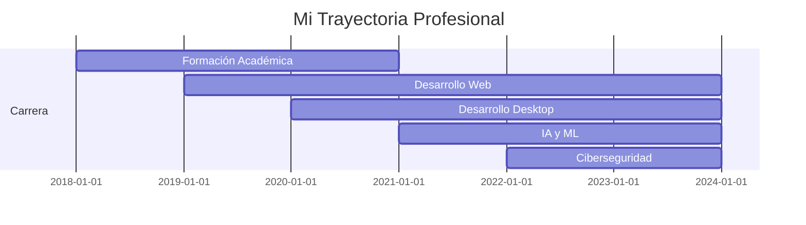

  
  <h1>👨‍💻 Andi Quis | Desarrollador Multidisciplinario 👨‍💻</h1>
  
  
  
  
  
  

## 🚀 Sobre Mí

### ¡Hola Mundo! 👋

Soy **Andi**, un apasionado desarrollador de software con una curiosidad insaciable por la tecnología y la innovación. Me encanta crear soluciones elegantes para problemas complejos y explorar nuevas tecnologías que amplíen mis horizontes.

> 💡 *"El código es poesía escrita con lógica"*

 

## 🛠️ Habilidades Técnicas

  
| Categoría | Tecnologías |
|-----------|-------------|
| **Frontend** |      |
| **Backend** |     |
| **Bases de Datos** |    |
| **DevOps & Tools** |    |
| **Inteligencia Artificial** |    |
| **Desarrollo Móvil** |   |
| **Cyberseguridad** |   |

## 🔍 Áreas de Especialización

- 💻 **Desarrollo Web Full-Stack** - Creación de aplicaciones web responsivas y dinámicas
- 🖥️ **Aplicaciones de Escritorio** - Soluciones robustas con C# .NET y Electron
- 📱 **Desarrollo Móvil** - Experiencias fluidas con MAUI y tecnologías híbridas
- 🧠 **Inteligencia Artificial & ML** - Entrenamiento de modelos y análisis de datos
- 👁️ **Visión por Computadora** - Reconocimiento de imágenes y procesamiento visual
- 🔐 **Ciberseguridad** - Protección de sistemas y análisis de vulnerabilidades
- 🤖 **Hardware con IA** - Integración de algoritmos inteligentes en dispositivos físicos

## 📊 Estadísticas de GitHub

  
    
  
  

   
  

## 🌟 Proyectos Destacados

  
  

## 💼 Experiencia Profesional

## 🎯 Objetivos Actuales

- 📚 Profundizar en arquitecturas avanzadas de Deep Learning
- 🔄 Contribuir a proyectos open source
- 🌐 Explorar Web3 y tecnologías blockchain
- 📝 Compartir conocimientos a través de tutoriales y artículos

<table border="4px" width="100%" align="center">
    <tr>
        <td border="0px" width="25%"></td>
        <td border="0px" colspan="3" width="75%"></td>
    </tr>
</table>

## 🔗 Conéctate Conmigo

  
  
  
  

  <h2>⚙️ Recursos y Herramientas</h2>
  
  
    
  
  
  
  
✨ <i>Gracias por visitar mi perfil. ¡Espero que podamos colaborar pronto!</i> ✨

  
  

